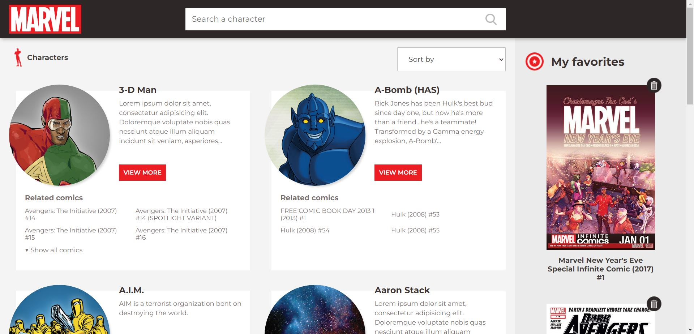
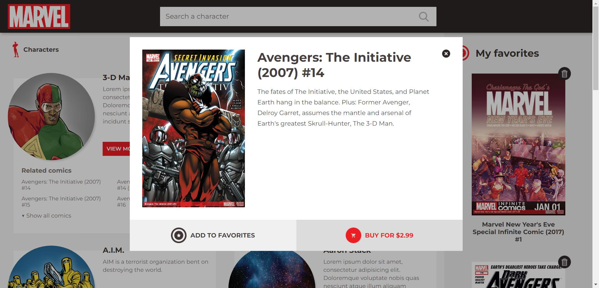
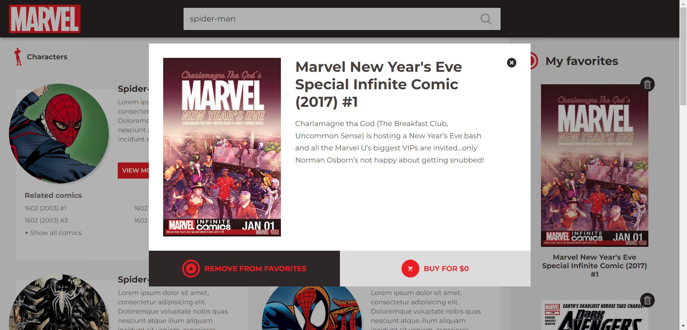

# Marvel Project angular


App to search comics and heroes of the marvel universe. Uses the Official Marvel API https://developer.marvel.com/


You can see the site live here https://marvel.andrescode.com/

## Steps to run

1. Install dependencies with ```npm i```
2. Set the environment variables of the ```.env.example``` in a ```.env``` file.
3. Run ```npm run envs``` or directly ```npm start``` to generate the environments folder
4. Run ```npm start``` or ```ng serve``` to run the local server in dev environment.


## Environment variables
* `API_URL` Is the base url of the MARVEL API. You can get it in the Marvel API docs
* `API_KEY` Is a key generated by the Marvel API docs. You can create your own creating an account in the Marvel API docs https://developer.marvel.com/account


## Captures

* 
* 
* 


